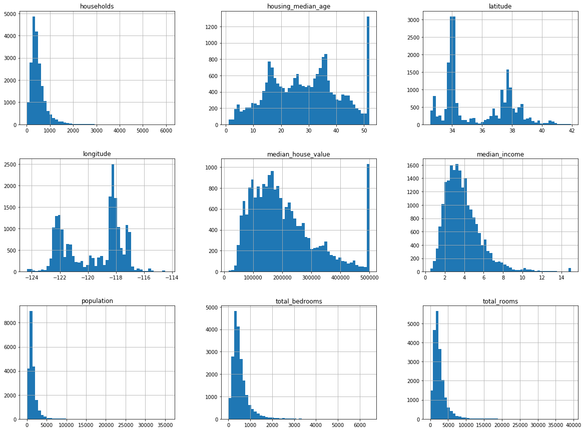
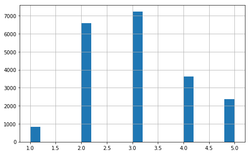
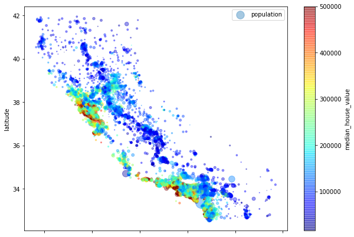

## Download the dataset


```python
import os
import tarfile
from six.moves import urllib

DOWNLOAD_ROOT = "https://raw.githubusercontent.com/ageron/handson-ml/master/"
HOUSING_PATH = os.path.join("datasets", "housing")
HOUSING_URL = DOWNLOAD_ROOT + "datasets/housing/housing.tgz"

def fetch_housing_data(housing_url=HOUSING_URL, housing_path=HOUSING_PATH):
    if not os.path.isdir(housing_path):
        os.makedirs(housing_path)
    tgz_path = os.path.join(housing_path, "housing.tgz")
    urllib.request.urlretrieve(housing_url, tgz_path)
    housing_tgz = tarfile.open(tgz_path)
    housing_tgz.extractall(path=housing_path)
    housing_tgz.close()

```


```python
import pandas as pd

def load_housing_data(housing_path=HOUSING_PATH):
    csv_path = os.path.join(housing_path, "housing.csv")
    return pd.read_csv(csv_path)
```

## Analyze the data


```python
# Download housing data and load into panda
fetch_housing_data()
housing = load_housing_data()
```


```python
housing.head()
```


<div>
<style scoped>
    .dataframe tbody tr th:only-of-type {
        vertical-align: middle;
    }

    .dataframe tbody tr th {
        vertical-align: top;
    }

    .dataframe thead th {
        text-align: right;
    }
</style>
<table border="1" class="dataframe">
  <thead>
    <tr style="text-align: right;">
      <th></th>
      <th>longitude</th>
      <th>latitude</th>
      <th>housing_median_age</th>
      <th>total_rooms</th>
      <th>total_bedrooms</th>
      <th>population</th>
      <th>households</th>
      <th>median_income</th>
      <th>median_house_value</th>
      <th>ocean_proximity</th>
    </tr>
  </thead>
  <tbody>
    <tr>
      <th>0</th>
      <td>-122.23</td>
      <td>37.88</td>
      <td>41.0</td>
      <td>880.0</td>
      <td>129.0</td>
      <td>322.0</td>
      <td>126.0</td>
      <td>8.3252</td>
      <td>452600.0</td>
      <td>NEAR BAY</td>
    </tr>
    <tr>
      <th>1</th>
      <td>-122.22</td>
      <td>37.86</td>
      <td>21.0</td>
      <td>7099.0</td>
      <td>1106.0</td>
      <td>2401.0</td>
      <td>1138.0</td>
      <td>8.3014</td>
      <td>358500.0</td>
      <td>NEAR BAY</td>
    </tr>
    <tr>
      <th>2</th>
      <td>-122.24</td>
      <td>37.85</td>
      <td>52.0</td>
      <td>1467.0</td>
      <td>190.0</td>
      <td>496.0</td>
      <td>177.0</td>
      <td>7.2574</td>
      <td>352100.0</td>
      <td>NEAR BAY</td>
    </tr>
    <tr>
      <th>3</th>
      <td>-122.25</td>
      <td>37.85</td>
      <td>52.0</td>
      <td>1274.0</td>
      <td>235.0</td>
      <td>558.0</td>
      <td>219.0</td>
      <td>5.6431</td>
      <td>341300.0</td>
      <td>NEAR BAY</td>
    </tr>
    <tr>
      <th>4</th>
      <td>-122.25</td>
      <td>37.85</td>
      <td>52.0</td>
      <td>1627.0</td>
      <td>280.0</td>
      <td>565.0</td>
      <td>259.0</td>
      <td>3.8462</td>
      <td>342200.0</td>
      <td>NEAR BAY</td>
    </tr>
  </tbody>
</table>
</div>


```python
housing.info()
```

    <class 'pandas.core.frame.DataFrame'>
    RangeIndex: 20640 entries, 0 to 20639
    Data columns (total 10 columns):
    longitude             20640 non-null float64
    latitude              20640 non-null float64
    housing_median_age    20640 non-null float64
    total_rooms           20640 non-null float64
    total_bedrooms        20433 non-null float64
    population            20640 non-null float64
    households            20640 non-null float64
    median_income         20640 non-null float64
    median_house_value    20640 non-null float64
    ocean_proximity       20640 non-null object
    dtypes: float64(9), object(1)
    memory usage: 1.6+ MB


```python
# Check categories of ocean_proximity
housing['ocean_proximity'].value_counts()
```


    <1H OCEAN     9136
    INLAND        6551
    NEAR OCEAN    2658
    NEAR BAY      2290
    ISLAND           5
    Name: ocean_proximity, dtype: int64


```python
# describe shows a summary of the numerical attribtues
housing.describe()
```


<div>
<style scoped>
    .dataframe tbody tr th:only-of-type {
        vertical-align: middle;
    }

    .dataframe tbody tr th {
        vertical-align: top;
    }

    .dataframe thead th {
        text-align: right;
    }
</style>
<table border="1" class="dataframe">
  <thead>
    <tr style="text-align: right;">
      <th></th>
      <th>longitude</th>
      <th>latitude</th>
      <th>housing_median_age</th>
      <th>total_rooms</th>
      <th>total_bedrooms</th>
      <th>population</th>
      <th>households</th>
      <th>median_income</th>
      <th>median_house_value</th>
    </tr>
  </thead>
  <tbody>
    <tr>
      <th>count</th>
      <td>20640.000000</td>
      <td>20640.000000</td>
      <td>20640.000000</td>
      <td>20640.000000</td>
      <td>20433.000000</td>
      <td>20640.000000</td>
      <td>20640.000000</td>
      <td>20640.000000</td>
      <td>20640.000000</td>
    </tr>
    <tr>
      <th>mean</th>
      <td>-119.569704</td>
      <td>35.631861</td>
      <td>28.639486</td>
      <td>2635.763081</td>
      <td>537.870553</td>
      <td>1425.476744</td>
      <td>499.539680</td>
      <td>3.870671</td>
      <td>206855.816909</td>
    </tr>
    <tr>
      <th>std</th>
      <td>2.003532</td>
      <td>2.135952</td>
      <td>12.585558</td>
      <td>2181.615252</td>
      <td>421.385070</td>
      <td>1132.462122</td>
      <td>382.329753</td>
      <td>1.899822</td>
      <td>115395.615874</td>
    </tr>
    <tr>
      <th>min</th>
      <td>-124.350000</td>
      <td>32.540000</td>
      <td>1.000000</td>
      <td>2.000000</td>
      <td>1.000000</td>
      <td>3.000000</td>
      <td>1.000000</td>
      <td>0.499900</td>
      <td>14999.000000</td>
    </tr>
    <tr>
      <th>25%</th>
      <td>-121.800000</td>
      <td>33.930000</td>
      <td>18.000000</td>
      <td>1447.750000</td>
      <td>296.000000</td>
      <td>787.000000</td>
      <td>280.000000</td>
      <td>2.563400</td>
      <td>119600.000000</td>
    </tr>
    <tr>
      <th>50%</th>
      <td>-118.490000</td>
      <td>34.260000</td>
      <td>29.000000</td>
      <td>2127.000000</td>
      <td>435.000000</td>
      <td>1166.000000</td>
      <td>409.000000</td>
      <td>3.534800</td>
      <td>179700.000000</td>
    </tr>
    <tr>
      <th>75%</th>
      <td>-118.010000</td>
      <td>37.710000</td>
      <td>37.000000</td>
      <td>3148.000000</td>
      <td>647.000000</td>
      <td>1725.000000</td>
      <td>605.000000</td>
      <td>4.743250</td>
      <td>264725.000000</td>
    </tr>
    <tr>
      <th>max</th>
      <td>-114.310000</td>
      <td>41.950000</td>
      <td>52.000000</td>
      <td>39320.000000</td>
      <td>6445.000000</td>
      <td>35682.000000</td>
      <td>6082.000000</td>
      <td>15.000100</td>
      <td>500001.000000</td>
    </tr>
  </tbody>
</table>
</div>


## Plot the data


```python
# only in a jupyter notebook to show the plots in the notebook
%matplotlib inline 
import matplotlib.pyplot as plt
housing.hist(bins=50, figsize=(20,15))
plt.show()
```





## Various ways to split the data


```python
import numpy as np

def split_train_test(data, test_ratio):
    shuffled_indices = np.random.permutation(len(data))
    test_set_size = int(len(data)*test_ratio)
    test_indices = shuffled_indices[:test_set_size]
    train_indices = shuffled_indices[test_set_size:]
    return data.iloc[train_indices], data.iloc[test_indices]

```


```python
train_set, test_set = split_train_test(housing, 0.2)
print("{0} train + {1} test".format(len(train_set), len(test_set)))
```

    16512 train + 4128 test


```python
# To keep the a seperate test set even when the root data is updated.
# Compute a hash of each instance's identifier, keep only the last byte of the hash, 
# and put the instance in the test set if this value is lower or equal to 51 (~20% of 256).
# This ensures that the test set will reamin consistens across multiple runs, even after refreshing the dataset.
# The new test set will containt 20% of the new instances, but will not contain any instance that was previously
# in the training set.

import hashlib

def test_set_check(identifier, test_ratio, hash):
    return hash(np.int64(identifier)).digest()[-1] < 256 * test_ratio

def split_train_test_by_id(data, test_ratio, id_column, hash=hashlib.sha256):
    ids = data[id_column]
    in_test_set = ids.apply(lambda id_: test_set_check(id_, test_ratio, hash))
    return data.loc[~in_test_set], data.loc[in_test_set]

housing_with_id = housing.reset_index() # adds an 'index' column
train_set, test_set = split_train_test_by_id(housing_with_id, 0.2, "index")
print("{0} train + {1} test".format(len(train_set), len(test_set)))
```

    16493 train + 4147 test


```python
train_set.head()
```


<div>
<style scoped>
    .dataframe tbody tr th:only-of-type {
        vertical-align: middle;
    }

    .dataframe tbody tr th {
        vertical-align: top;
    }

    .dataframe thead th {
        text-align: right;
    }
</style>
<table border="1" class="dataframe">
  <thead>
    <tr style="text-align: right;">
      <th></th>
      <th>index</th>
      <th>longitude</th>
      <th>latitude</th>
      <th>housing_median_age</th>
      <th>total_rooms</th>
      <th>total_bedrooms</th>
      <th>population</th>
      <th>households</th>
      <th>median_income</th>
      <th>median_house_value</th>
      <th>ocean_proximity</th>
    </tr>
  </thead>
  <tbody>
    <tr>
      <th>0</th>
      <td>0</td>
      <td>-122.23</td>
      <td>37.88</td>
      <td>41.0</td>
      <td>880.0</td>
      <td>129.0</td>
      <td>322.0</td>
      <td>126.0</td>
      <td>8.3252</td>
      <td>452600.0</td>
      <td>NEAR BAY</td>
    </tr>
    <tr>
      <th>1</th>
      <td>1</td>
      <td>-122.22</td>
      <td>37.86</td>
      <td>21.0</td>
      <td>7099.0</td>
      <td>1106.0</td>
      <td>2401.0</td>
      <td>1138.0</td>
      <td>8.3014</td>
      <td>358500.0</td>
      <td>NEAR BAY</td>
    </tr>
    <tr>
      <th>2</th>
      <td>2</td>
      <td>-122.24</td>
      <td>37.85</td>
      <td>52.0</td>
      <td>1467.0</td>
      <td>190.0</td>
      <td>496.0</td>
      <td>177.0</td>
      <td>7.2574</td>
      <td>352100.0</td>
      <td>NEAR BAY</td>
    </tr>
    <tr>
      <th>3</th>
      <td>3</td>
      <td>-122.25</td>
      <td>37.85</td>
      <td>52.0</td>
      <td>1274.0</td>
      <td>235.0</td>
      <td>558.0</td>
      <td>219.0</td>
      <td>5.6431</td>
      <td>341300.0</td>
      <td>NEAR BAY</td>
    </tr>
    <tr>
      <th>4</th>
      <td>4</td>
      <td>-122.25</td>
      <td>37.85</td>
      <td>52.0</td>
      <td>1627.0</td>
      <td>280.0</td>
      <td>565.0</td>
      <td>259.0</td>
      <td>3.8462</td>
      <td>342200.0</td>
      <td>NEAR BAY</td>
    </tr>
  </tbody>
</table>
</div>


```python
test_set.head()
```


<div>
<style scoped>
    .dataframe tbody tr th:only-of-type {
        vertical-align: middle;
    }

    .dataframe tbody tr th {
        vertical-align: top;
    }

    .dataframe thead th {
        text-align: right;
    }
</style>
<table border="1" class="dataframe">
  <thead>
    <tr style="text-align: right;">
      <th></th>
      <th>index</th>
      <th>longitude</th>
      <th>latitude</th>
      <th>housing_median_age</th>
      <th>total_rooms</th>
      <th>total_bedrooms</th>
      <th>population</th>
      <th>households</th>
      <th>median_income</th>
      <th>median_house_value</th>
      <th>ocean_proximity</th>
    </tr>
  </thead>
  <tbody>
    <tr>
      <th>6</th>
      <td>6</td>
      <td>-122.25</td>
      <td>37.84</td>
      <td>52.0</td>
      <td>2535.0</td>
      <td>489.0</td>
      <td>1094.0</td>
      <td>514.0</td>
      <td>3.6591</td>
      <td>299200.0</td>
      <td>NEAR BAY</td>
    </tr>
    <tr>
      <th>14</th>
      <td>14</td>
      <td>-122.26</td>
      <td>37.85</td>
      <td>52.0</td>
      <td>2643.0</td>
      <td>626.0</td>
      <td>1212.0</td>
      <td>620.0</td>
      <td>1.9167</td>
      <td>159200.0</td>
      <td>NEAR BAY</td>
    </tr>
    <tr>
      <th>16</th>
      <td>16</td>
      <td>-122.27</td>
      <td>37.85</td>
      <td>52.0</td>
      <td>1966.0</td>
      <td>347.0</td>
      <td>793.0</td>
      <td>331.0</td>
      <td>2.7750</td>
      <td>152500.0</td>
      <td>NEAR BAY</td>
    </tr>
    <tr>
      <th>18</th>
      <td>18</td>
      <td>-122.26</td>
      <td>37.84</td>
      <td>50.0</td>
      <td>2239.0</td>
      <td>455.0</td>
      <td>990.0</td>
      <td>419.0</td>
      <td>1.9911</td>
      <td>158700.0</td>
      <td>NEAR BAY</td>
    </tr>
    <tr>
      <th>26</th>
      <td>26</td>
      <td>-122.28</td>
      <td>37.85</td>
      <td>49.0</td>
      <td>1130.0</td>
      <td>244.0</td>
      <td>607.0</td>
      <td>239.0</td>
      <td>2.4597</td>
      <td>93800.0</td>
      <td>NEAR BAY</td>
    </tr>
  </tbody>
</table>
</div>


```python
# Another method for splitting using scikit learn
from sklearn.model_selection import train_test_split

train_set, test_set = train_test_split(housing, test_size=0.2, random_state=42)
print("{0} train + {1} test".format(len(train_set), len(test_set)))
```

    16512 train + 4128 test


```python
# Create stratas for income
# The following code creates an income category by dividing the median income by 1.5 (to limit th number of income categories)
# Rounding up using 'ceil' to create discrete categories and then merging all the categories greather than 5 into category 5.

housing['income_cat'] = np.ceil(housing['median_income'] / 1.5)
housing['income_cat'].where(housing['income_cat'] < 5, 5.0, inplace=True)
housing['income_cat'].head()
```


    0    5.0
    1    5.0
    2    5.0
    3    4.0
    4    3.0
    Name: income_cat, dtype: float64


```python
%matplotlib inline 
housing['income_cat'].hist(bins=20, figsize=(8,5))
plt.show()
```





```python
# Do stratified sampling based on the income category
from sklearn.model_selection import StratifiedShuffleSplit

split = StratifiedShuffleSplit(n_splits=1, test_size=0.2, random_state=42)
for train_index, test_index in split.split(housing, housing['income_cat']):
    strat_train_set = housing.loc[train_index]
    strat_test_set = housing.loc[test_index]

strat_test_set['income_cat'].value_counts() / len(strat_test_set)
```


    3.0    0.350533
    2.0    0.318798
    4.0    0.176357
    5.0    0.114583
    1.0    0.039729
    Name: income_cat, dtype: float64


```python
train_set, test_set = train_test_split(housing, test_size=0.2, random_state=42)
strat_test = strat_test_set['income_cat'].value_counts() / len(strat_test_set)
random_test = test_set['income_cat'].value_counts() / len(test_set)
overall = housing['income_cat'].value_counts() / len(housing)

print('Sampling bias comparison')
df = pd.DataFrame({"Stratified": strat_test, "Overall": overall, "Random": random_test, "Rand. %error": 100*(random_test-overall)/overall, "Strat. %error": 100*(strat_test-overall)/overall}).sort_index()
df
```

    Sampling bias comparison


<div>
<style scoped>
    .dataframe tbody tr th:only-of-type {
        vertical-align: middle;
    }

    .dataframe tbody tr th {
        vertical-align: top;
    }

    .dataframe thead th {
        text-align: right;
    }
</style>
<table border="1" class="dataframe">
  <thead>
    <tr style="text-align: right;">
      <th></th>
      <th>Overall</th>
      <th>Rand. %error</th>
      <th>Random</th>
      <th>Strat. %error</th>
      <th>Stratified</th>
    </tr>
  </thead>
  <tbody>
    <tr>
      <th>1.0</th>
      <td>0.039826</td>
      <td>0.973236</td>
      <td>0.040213</td>
      <td>-0.243309</td>
      <td>0.039729</td>
    </tr>
    <tr>
      <th>2.0</th>
      <td>0.318847</td>
      <td>1.732260</td>
      <td>0.324370</td>
      <td>-0.015195</td>
      <td>0.318798</td>
    </tr>
    <tr>
      <th>3.0</th>
      <td>0.350581</td>
      <td>2.266446</td>
      <td>0.358527</td>
      <td>-0.013820</td>
      <td>0.350533</td>
    </tr>
    <tr>
      <th>4.0</th>
      <td>0.176308</td>
      <td>-5.056334</td>
      <td>0.167393</td>
      <td>0.027480</td>
      <td>0.176357</td>
    </tr>
    <tr>
      <th>5.0</th>
      <td>0.114438</td>
      <td>-4.318374</td>
      <td>0.109496</td>
      <td>0.127011</td>
      <td>0.114583</td>
    </tr>
  </tbody>
</table>
</div>


```python
# Remove income category
for set_ in (strat_train_set, strat_test_set):
    set_.drop('income_cat', axis=1, inplace=True)
```

## Discover and visualize the data to gain insights


```python
# Create a copy of the training set for tests and manipulations
housing = strat_train_set.copy()
```

### Visualising Geographical Data


```python
housing.plot(kind="scatter", x="longitude", y="latitude")
```


    <matplotlib.axes._subplots.AxesSubplot at 0x115b5bc88>


```python
# Changing the alpha value to discern places of high density
housing.plot(kind="scatter", x="longitude", y="latitude", alpha=0.1)
```


    <matplotlib.axes._subplots.AxesSubplot at 0x113626630>


### Looking at housing prices with detailed graph


```python
# The radius of each circle represents the district's population, and the color represents the price.
# Blue = low values, Red = high values

housing.plot(kind="scatter", x="longitude", y="latitude", alpha=0.4, 
             s=housing['population']/100, 
             label="population",
             figsize=(10,7),
             c="median_house_value",
             cmap=plt.get_cmap("jet"),
             colorbar=True)
plt.legend()
```


    <matplotlib.legend.Legend at 0x11613e780>





```python

```
